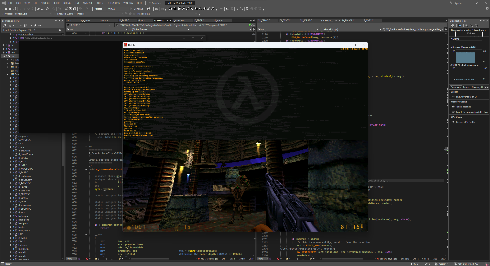

# half-life1_win32_722 

Reverse-engineered source code of Half-Life 1 Net Test 1 (engine build 722), an early pre-release version of the GoldSrc engine (known at the time as "The Half-Life Engine") distributed to playtesters.

The build was published in October 2024 by playtester [Chad Jessup](https://x.com/ubahs1337) and later reverse-engineered by our team.



---

## Getting started

**Before building the project, you need to configure the deployment path (ONLY FOR VS2022).**

The file **DeployPath.ini** defines where compiled binaries will be automatically deployed.  
Example:
```
; Working directory
root.path="E:\Half-Life NetTest1"
```

## Building

### Visual Studio 2022
Open the solution file located at:
```
..\half-life1_win32_722\projects\vs2022\Half-Life (722 Build, 1998).sln
```

Now press `Build` -> `Build Solution` (or press `Ctrl+Shift+B` hotkey).

### Visual C++ 4.2
Open any specific project you want to build, for example:
```
..\half-life1_win32_722\engine\Quiver.mak
```
All project files are located in their directories.

Now press `Build`  -> `Build X.dll` (or press `Shift+F8` hotkey).

**WARNING: don't forget to set the Working Directory in the project properties, otherwise the engine may fail to load the GameDLL.**

## Required files for playing
You will need the original data files from Half-Life 1 Net Test 1.
They are publicly available online and can be found on archival sources such as the Internet Archive.

## People involved in development of the project
- [\*(int\*)0 = 0xDEADBEEF](https://github.com/KV-Stepchenko)
- [ScriptedSnark](https://github.com/ScriptedSnark)
- [xWhitey](https://github.com/autisoid)
- [s1lentq](https://github.com/s1lentq)
- [oxiKKK](https://github.com/oxiKKK)

## Referenced projects
- [WinQuake / QuakeWorld](https://github.com/id-Software/Quake)
- [QGL Wrapper (Quake II)](https://github.com/id-Software/Quake-2/blob/master/win32/qgl_win.c)
- [Half-Life SDK](https://github.com/ValveSoftware/halflife)
- [Half-Life SDK 1.0](https://github.com/ScriptedSnark/hlsdk-versions/tree/hlsdk_sp_1_0)
- [Half-Life SDK 2.3](https://github.com/ScriptedSnark/hlsdk-versions/tree/hlsdk_sp_2_3)

## Special thanks
- [Overfloater](https://github.com/TheOverfloater)
- [Barspinoff](https://github.com/barspinoff)